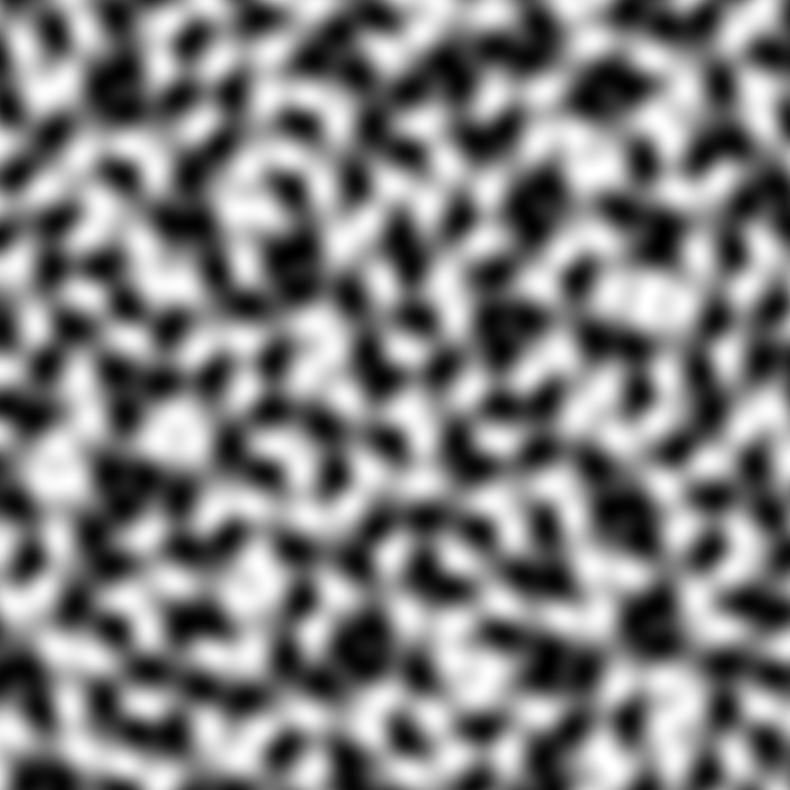

# FastNoise Lite written in rust

`fast-noise-lite-rs` is a Rust implementation of the [FastNoise Lite](https://github.com/Auburn/FastNoiseLite) library, which was originally written in C++. It has little to no difference in performance compared to the C++ version. This means that you can expect **similar performance** when using either version of the library.
This library provides fast and easy-to-use noise generation functions for procedural content creation. It supports various types of noise, such as **Perlin**, **OpenSimplex**, **Cellular**, and **Voronoi**, in 2D and 3D dimensions.

**FastNoise Lite** is an extremely portable open source noise generation library with a large selection of noise algorithms. It is an evolution of the [original FastNoise](https://github.com/Auburn/FastNoiseLite/tree/FastNoise-Legacy) library and shares the same goal: An easy to use library that can quickly be integrated into a project and provides performant modern noise generation.

###### simplex.png
